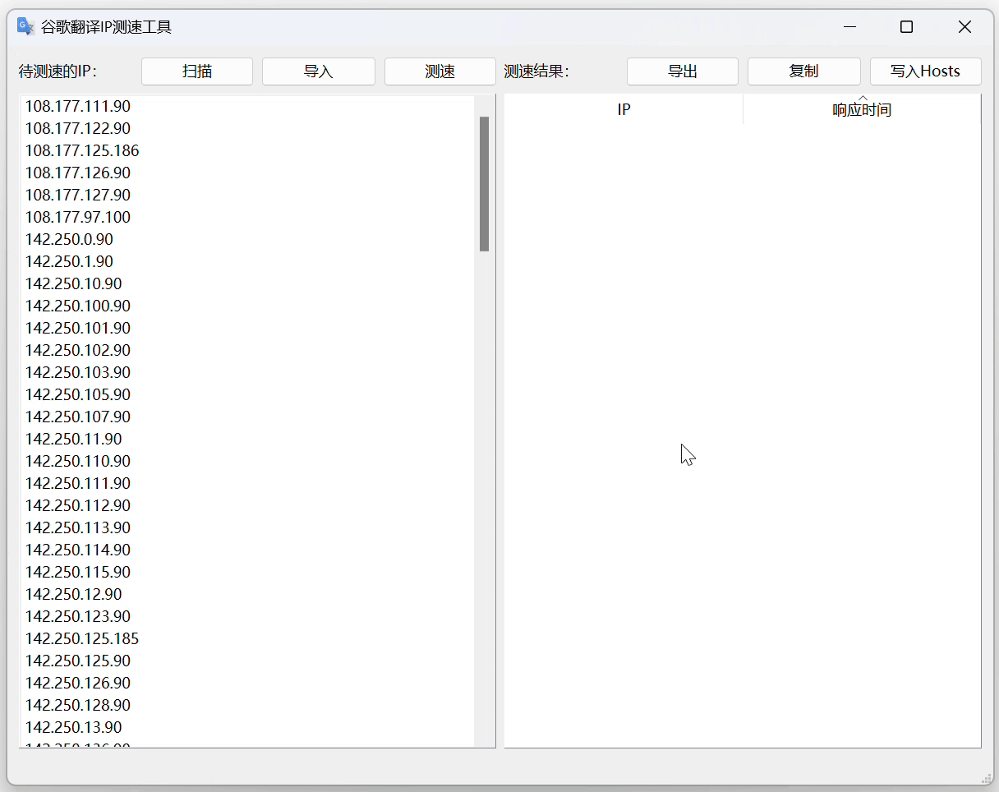

<div align="center">

<h1>GoogleTranslate_IPFinder</h1>

<a href="http://github.com/GoodCoder666/GoogleTranslate_IPFinder/releases"></a>
<a href="http://github.com/GoodCoder666/GoogleTranslate_IPFinder/releases"></a>
<a href="http://github.com/GoodCoder666/GoogleTranslate_IPFinder/LICENSE.md"></a>
<a href="http://github.com/GoodCoder666/GoogleTranslate_IPFinder/stargazers"></a>

<a href="./README.md">简体中文</a> | English

</div>

## Project summary

Google Translate API server (`translate.googleapis.com`) IP address scanning and speed test tool.

<details>
    <summary>Project Background</summary>
    Google stopped providing translation services on mainland China GWS servers in September 2022. This project aims to help users find usable GWS IPs and override local domain name resolution to access Google Translate servers.
</details>

<details>
    <summary>Disclaimer</summary>
    Please comply with local laws and Google's policies when using this open-source software. <strong>All consequences of illegal or unauthorized use are your own responsibility.</strong>
</details>

Stable version download link:

- [https://github.com/GoodCoder666/GoogleTranslate_IPFinder/releases](https://github.com/GoodCoder666/GoogleTranslate_IPFinder/releases)

Preview version (alpha) download links:

- Windows: [https://github.com/GoodCoder666/GoogleTranslate_IPFinder/releases/download/alpha/checker-win-x64.exe](https://github.com/GoodCoder666/GoogleTranslate_IPFinder/releases/download/alpha/checker-win-x64.exe)
- Mac OS: [https://github.com/GoodCoder666/GoogleTranslate_IPFinder/releases/download/alpha/checker-mac.zip](https://github.com/GoodCoder666/GoogleTranslate_IPFinder/releases/download/alpha/checker-mac.zip)

<details>
    <summary>About the English translations</summary>
    We <a href="https://github.com/GoodCoder666/GoogleTranslate_IPFinder/issues/38">noticed</a> that the tool might also be helpful in other countries/regions, thus English translations are added on 21 Sep, 2024. This document is mostly translated with ChatGPT and the UI is translated all by myself. Feel free to open an issue if something is wrong.
</details>


> [!NOTE]
>
> **This project has only been tested on Windows 11.** If you encounter bugs on other operating systems, please [submit an issue](https://github.com/GoodCoder666/GoogleTranslate_IPFinder/issues/new).
>
> *Due to the limitations of Python, this project does not support Windows 7 or earlier.*

## Quick Start

Steps for basic usage (speed test + Hosts file update):

1. Download the executable file for your system (links above).
2. Open it with administrator/sudo permissions. **This is required to use the Hosts file writing feature.**
3. Select "Test" and wait for the operation to complete.
4. Click "Update hosts," and the Google Translate API will be accessible.

> [!TIP]
>
> Difference between "Test" and "Scan":
>
> - **Test**: Identifies usable IPs from the available IPs (IP library) and sorts them by response time. Once this process is complete, you can write to the Hosts file.
> - **Scan**: Finds usable IPs from the GWS IP range and adds them to the IP library. *Since the GWS network is very large, scanning even a small preset part often takes a long time.*
>
> Generally, just start the program, select "Test" (using the default IP library), and then write to the Hosts file to restore access to Google Translate services.

A demonstration for Windows 11:



> [!WARNING]
>
> **The stability of IPv6 addresses is generally poor, so avoid using them unless absolutely necessary.**
>
> Considering IP stability, all IPs must pass at least 3 tests before they appear in the speed test results by default. If you want to verify the stability of a single IP, use the "Debug" feature.
>
> If you must use IPv6, it's recommended to set the number of speed tests to the maximum (10) in "Settings > Speed Test."
>
> For discussions on IP availability, see [#42](https://github.com/GoodCoder666/GoogleTranslate_IPFinder/issues/42).

## Feature Comparison

|     Feature     |      This Project       | [GoogleTranslateIpCheck](https://github.com/Ponderfly/GoogleTranslateIpCheck) | [google-translate-cn-ip](https://github.com/hcfyapp/google-translate-cn-ip) | [ip-scanner](https://github.com/csyezheng/ip-scanner) | [gscan_quic](https://codeberg.org/antigng/gscan_quic) |
| :-------------: | :---------------------: | :------------------------------------------------------: | :------------------------------------------------------: | :----------------------------------------------: | :----------------------------------------------: |
|   IP Collection  |        ✔️              |                          ✔️                               |                          ✔️                               |                          ✔️                       |                          ❌                       |
|   IP Scanning    |        ✔️              |                          ✔️                               |                          ❌                               |                          ✔️                       |                          ✔️                       |
|   IP Speed Test  |        ✔️              |                          ✔️                               |                          ✔️                               |                          ❌                       |                          ❌                       |
| Hosts File Write |        ✔️              |                          ✔️                               |                          ❌                               |                          ❌                       |                          ❌                       |
|     GUI          |        ✔️              |                          ❌                               |                          ❌                               |                          ❌                       |                          ❌                       |
| English Support | ✔️ | ❌ | ❌ | ❌ | ❌ |

## Running from Source

Running from source works on any operating system with a graphical interface, as long as Python >= 3.6 is installed (with the additional `PySide6` package).

For Linux:

```bash
$ git clone https://github.com/GoodCoder666/GoogleTranslate_IPFinder.git
$ cd GoogleTranslate_IPFinder
$ pip3 install PySide6
$ python3 main.py
```

For non-Linux systems:

```shell
git clone https://github.com/GoodCoder666/GoogleTranslate_IPFinder.git
cd GoogleTranslate_IPFinder
pip install -r requirements.txt
python main.py
```

## Development Roadmap

- [x] IP Speed Test
- [x] IP Scanning
- [x] Automatic Hosts File Write
- [x] Automatic IP List Retrieval
- [x] Speed Test/Scan Progress Bar
- [ ] Customizable IP Range Scanning

...(If you have other requests, feel free to submit them in the [issues](https://github.com/GoodCoder666/GoogleTranslate_IPFinder/issues)).

## About Online Syncing

> [!WARNING]
>
> The following mentioned libraries are designed for use in Mainland China. Consider running a full scan to get available IPs.
>
> This part may be outdated. Please refer to the Chinese README for accurate information.

The [official IPv4 address library](https://github.com/GoodCoder666/gtdb) is built into the program and is periodically updated with new features. You can sync the latest IP library via `Import -> Online service`. Two IP libraries from GoogleTranslateIpCheck are also available (thanks to @Ponderfly). The URLs of the three libraries are as follows:

- Official IPv4: https://raw.githubusercontent.com/GoodCoder666/gtdb/main/src/ip.txt
- Extended IPv4: https://raw.githubusercontent.com/Ponderfly/GoogleTranslateIpCheck/master/src/GoogleTranslateIpCheck/GoogleTranslateIpCheck/ip.txt
- Extended IPv6: https://raw.githubusercontent.com/Ponderfly/GoogleTranslateIpCheck/master/src/GoogleTranslateIpCheck/GoogleTranslateIpCheck/IPv6.txt

Additionally, if GitHub Raw cannot be connected, the program will attempt to use the [ghproxy](https://ghp.ci/) mirror. Please be patient.

## License Information

This project is licensed under the [GPLv3](https://github.com/GoodCoder666/GoogleTranslate_IPFinder/blob/main/LICENSE). The IP scanning logic references [gscan_quic](https://codeberg.org/antigng/gscan_quic).

Similar projects: [hcfyapp/google-translate-cn-ip](https://github.com/hcfyapp/google-translate-cn-ip) [Ponderfly/GoogleTranslateIpCheck](https://github.com/Ponderfly/GoogleTranslateIpCheck) [csyezheng/ip-scanner](https://github.com/csyezheng/ip-scanner).