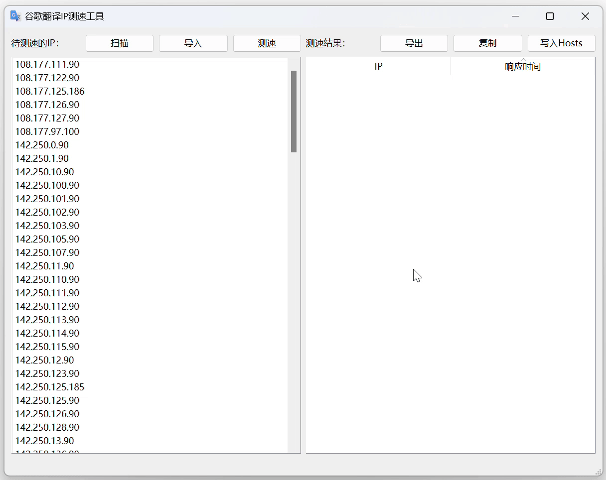

<div align="center">

<h1>GoogleTranslate_IPFinder</h1>

<a href="https://github.com/GoodCoder666/GoogleTranslate_IPFinder/releases/latest"></a>
<a href="https://github.com/GoodCoder666/GoogleTranslate_IPFinder/releases/latest"></a>
<a href="https://www.gnu.org/licenses/gpl-3.0.html"></a>
<a href="https://github.com/GoodCoder666/GoogleTranslate_IPFinder/releases"></a>
<a href="https://github.com/GoodCoder666/GoogleTranslate_IPFinder/stargazers"></a>

<a href="./README.md">简体中文</a> | English

</div>

## About the Project

An IP address scanner and speed testing tool for the Google Translate API server (`translate.googleapis.com`).

<details>
    <summary>Disclaimer</summary>
    When using this open-source software, please comply with local laws and regulations, as well as relevant Google policies. <strong>You are solely responsible for any consequences arising from illegal or non-compliant use.</strong>
</details>

If you are using Windows or macOS, you can download the latest pre-built releases directly here:

- [https://github.com/GoodCoder666/GoogleTranslate_IPFinder/releases](https://github.com/GoodCoder666/GoogleTranslate_IPFinder/releases)

For Windows, we provide two versions with identical functionality but different build methods:

- `checker-win-x64.exe`: PyInstaller build. Recommended for users who prioritize stability and compatibility.
- `checker-win-nuitka.exe`: Nuitka build. Recommended for users who prefer a smaller file size and higher performance. **If you encounter any unknown errors with this version, please let me know in the issues and temporarily switch to the PyInstaller version until the problem is resolved.**

<details>
    <summary>About the English translations</summary>
    We <a href="https://github.com/GoodCoder666/GoogleTranslate_IPFinder/issues/38">noticed</a> that the tool might also be helpful in other countries/regions, thus English translations are added on 21 Sep, 2024. This document is mostly translated with <strong>Gemini 3.1 Pro</strong> and the UI is translated all by myself. Feel free to open an issue if something is wrong.
</details>

> [!NOTE]
>
> **This project has only been tested on Windows 11.** If the program does not work properly on other operating systems, please [open an issue](https://github.com/GoodCoder666/GoogleTranslate_IPFinder/issues/new).
>
> *Due to Python limitations, this project does not support Windows 7 and below.*

## Quick Start

Standard usage steps:

1. Download the executable file for your OS from the Releases page (links above).
2. Run the program. If you plan to update your Hosts file in step 4, please manually run the program with elevated privileges.
3. Select "Speedtest", and the program will find the IP address with the lowest latency.
4. (Optional) If you wish to optimize custom network resolution, click "Write to Hosts" and confirm the changes in the pop-up window that appears.

> [!TIP]
>
> Difference between "Speed Test" and "Scan":
>
> - **Speed Test**: Finds available IPs from the IPs to be tested (i.e., the IP library) and sorts them by response time. After this operation is complete, you can write the results to your Hosts file.
> - **Scan**: Finds available IPs from selected IP ranges and puts them into the IP library. *Because the GWS network is extremely large, scanning even a small preset portion usually takes a long time.*

Windows 11 system demonstration:



> [!WARNING]
>
> **The stability of IPv6 addresses is generally poor; try to avoid using them unless absolutely necessary.**
>
> Considering IP stability issues, under default settings, all IPs must pass at least 3 tests before being displayed in the speed test results. If you want to verify the stability of a single IP, please use the "Debug" feature.
>
> If you must use IPv6, it is recommended to adjust the test count to the maximum value of 10 under "Settings > Speedtest".
>
> For discussions regarding IP availability issues, please refer to [#42](https://github.com/GoodCoder666/GoogleTranslate_IPFinder/issues/42).

## Running from Source Code

Running from source code is applicable to all operating systems that support graphical interfaces. It requires Python >= 3.10 (3.12 and above is recommended).

For Linux:

```bash
git clone https://github.com/GoodCoder666/GoogleTranslate_IPFinder.git
cd GoogleTranslate_IPFinder
pip3 install PySide6 aiohttp
python3 run.py
```

For non-Linux systems:

```shell
git clone https://github.com/GoodCoder666/GoogleTranslate_IPFinder.git
cd GoogleTranslate_IPFinder
pip install -r requirements.txt
python run.py
```

## About the Online Sync Feature

The [Official IPv4 Address Library](https://github.com/GoodCoder666/gtdb) is built into the program and is updated periodically alongside feature updates. You can sync the latest IP library via `Import -> Online Services`. Additionally, two IP libraries from GoogleTranslateIpCheck are provided as options (Thanks to @Ponderfly). The URLs for the three libraries are as follows:

* Official IPv4: https://raw.githubusercontent.com/GoodCoder666/gtdb/main/src/ip.txt
* Extended IPv4: https://raw.githubusercontent.com/Ponderfly/GoogleTranslateIpCheck/master/src/GoogleTranslateIpCheck/GoogleTranslateIpCheck/ip.txt
* Extended IPv6: https://raw.githubusercontent.com/Ponderfly/GoogleTranslateIpCheck/master/src/GoogleTranslateIpCheck/GoogleTranslateIpCheck/IPv6.txt

## License

This project is licensed under [GPL-3.0-or-later](https://www.gnu.org/licenses/gpl-3.0.html). The IP scanning logic is inspired by [gscan_quic](https://codeberg.org/antigng/gscan_quic).

Similar projects: [hcfyapp/google-translate-cn-ip](https://github.com/hcfyapp/google-translate-cn-ip) | [Ponderfly/GoogleTranslateIpCheck](https://github.com/Ponderfly/GoogleTranslateIpCheck) | [csyezheng/ip-scanner](https://github.com/csyezheng/ip-scanner)
