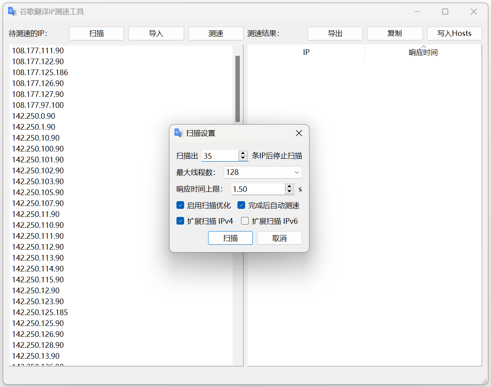

# GoogleTranslate_IPFinder

谷歌翻译服务器（`translate.googleapis.com`）在中国大陆的IP地址扫描、测速工具。

项目使用Python编写，GUI使用的是 `PySide6`（Qt for Python 6）。

下载地址：

- Windows: [https://github.com/GoodCoder666/GoogleTranslate_IPFinder/releases/download/alpha/checker-win-x64.exe](https://github.com/GoodCoder666/GoogleTranslate_IPFinder/releases/download/alpha/checker-win-x64.exe)
- Mac OS: [https://github.com/GoodCoder666/GoogleTranslate_IPFinder/releases/download/alpha/checker-mac.zip](https://github.com/GoodCoder666/GoogleTranslate_IPFinder/releases/download/alpha/checker-mac.zip)

## 屏幕截图




## 功能对比

|     功能     |       本项目       | [GoogleTranslateIpCheck](https://github.com/Ponderfly/GoogleTranslateIpCheck) | [google-translate-cn-ip](https://github.com/hcfyapp/google-translate-cn-ip) | [gscan_quic](https://github.com/Kisesy/gscan_quic) |
| :----------: | :----------------: | :----------------------------------------------------------: | :----------------------------------------------------------: | :------------------------------------------------: |
|   IP 收集    | :heavy_check_mark: |                      :heavy_check_mark:                      |                      :heavy_check_mark:                      |                        :x:                         |
|   IP 扫描    | :heavy_check_mark: |                      :heavy_check_mark:                      |                             :x:                              |                 :heavy_check_mark:                 |
|   IP 测速    | :heavy_check_mark: |                      :heavy_check_mark:                      |                      :heavy_check_mark:                      |                        :x:                         |
|  HOSTS 写入  | :heavy_check_mark: |                      :heavy_check_mark:                      |                             :x:                              |                        :x:                         |
| GUI 图形界面 | :heavy_check_mark: |                             :x:                              |                             :x:                              |                        :x:                         |

## 快速上手

### 使用打包好的可执行文件（仅限Windows和MacOS系统）

从[Releases](https://github.com/GoodCoder666/GoogleTranslate_IPFinder/releases/tag/alpha)页面下载对应系统的可执行文件，运行即可。

- Windows: [https://github.com/GoodCoder666/GoogleTranslate_IPFinder/releases/download/alpha/checker-win-x64.exe](https://github.com/GoodCoder666/GoogleTranslate_IPFinder/releases/download/alpha/checker-win-x64.exe)
- Mac OS: [https://github.com/GoodCoder666/GoogleTranslate_IPFinder/releases/download/alpha/checker-mac.zip](https://github.com/GoodCoder666/GoogleTranslate_IPFinder/releases/download/alpha/checker-mac.zip)

文件由GitHub Actions自动打包发布，如果下载慢可以用IDM/NDM等多线程下载器进行下载。

### 从源代码运行（适用于所有操作系统）

在命令行中依次执行如下命令（请提前安装好Python>=3.6和Git）：

```shell
git clone https://github.com/GoodCoder666/GoogleTranslate_IPFinder.git
pip install -r requirements.txt
python main.py
```

## 开发计划

- [X] IP 测速
- [X] IP 扫描
- [x] 自动写入 Hosts

...（若有其他需求欢迎在[issues](https://github.com/GoodCoder666/GoogleTranslate_IPFinder/issues)中提出）

## 版权说明

本项目使用[GPLv3](https://github.com/GoodCoder666/GoogleTranslate_IPFinder/blob/main/LICENSE)版权许可。IP 扫描逻辑参考[Kisesy/gscan_quic](https://github.com/Kisesy/gscan_quic)。

类似的项目：[hcfyapp/google-translate-cn-ip](https://github.com/hcfyapp/google-translate-cn-ip) [Ponderfly/GoogleTranslateIpCheck](https://github.com/Ponderfly/GoogleTranslateIpCheck)
